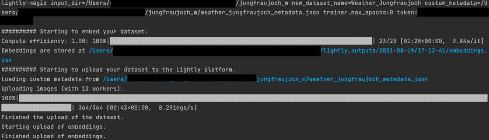
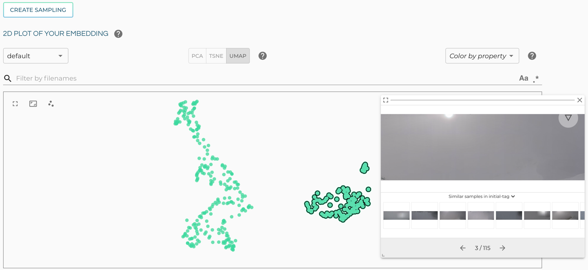
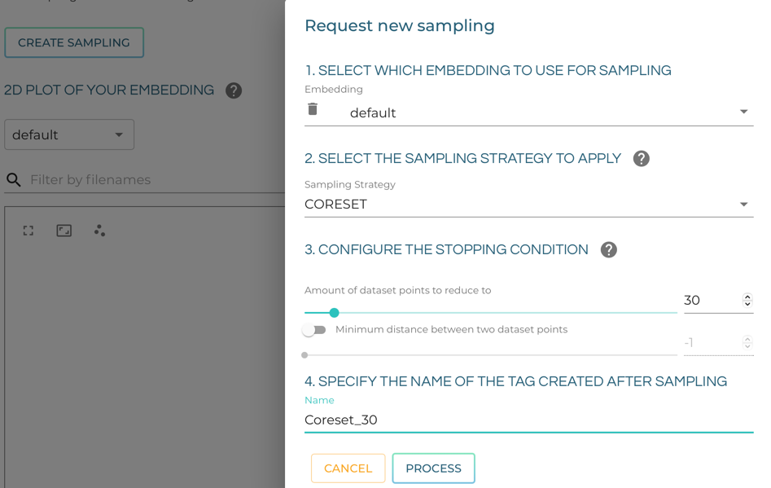
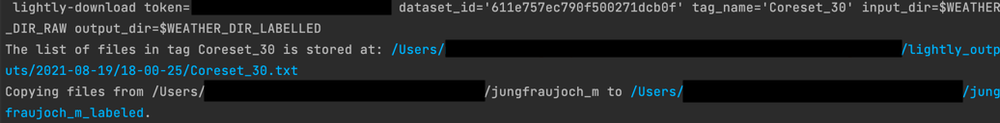
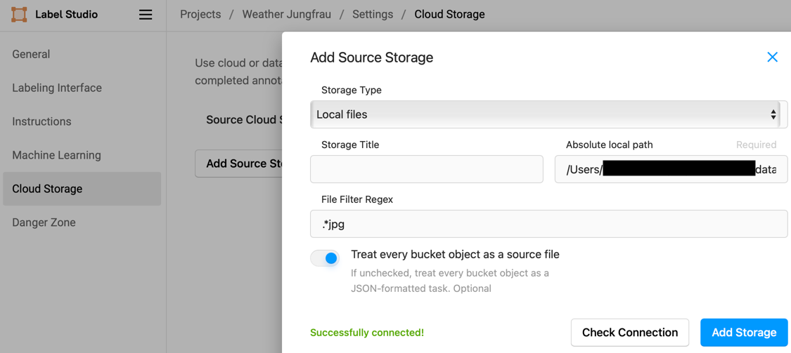
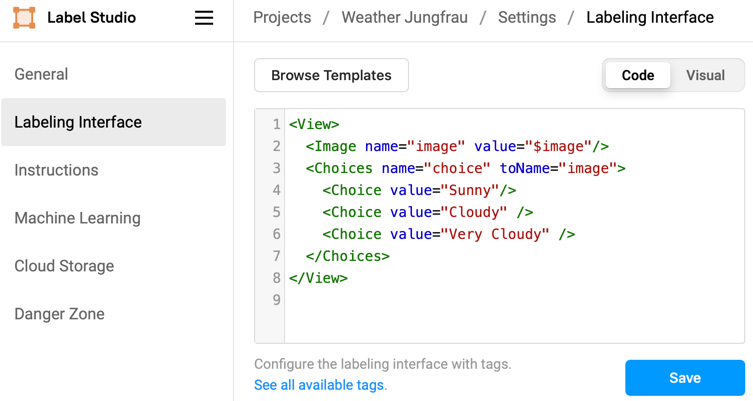

## Tutorial
This tutorial combines [Lightly](https://www.lightly.ai) and [LabelStudio](https://labelstud.io) 
for showing a complete workflow of creating a machine learning model including Active Learning.
1. It starts with collecting unlabelled data. 
2. Then it uses Lightly to choose a subset of the unlabelled to be labelled.
3. This subset is labelled with the help of LabelStudio.
4. A machine learning model is trained on the labeled data and Active Learning is used to choose the next batch to be labelled.
5. This batch is labelled again in LabelStudio.
6. The machine learning model is trained on the updated labelled dataset.
7. Finally, the model is used to predict on completely new data. 


## 0. Installation and Requirements
Make sure you have an account for the [Lightly Web App](https://app.lightly.ai). 
You also need to know your API token which is shown under your `USERNAME` -> `Preferences`.

Clone this repo and cd into it.
Install all python package requirements in the `requirements.txt` file, e.g. with pip.
```bash
git clone https://github.com/lightly-ai/Lightly_LabelStudio_AL.git
cd Lightly_LabelStudio_AL
pip install -r requirements.txt
```


## 1. Download the images
We want to train a classifier predicting whether a webcam targeting a mountain is showing sunny, cloudy, or very cloudy weather.
To gather our dataset, we use the webcam at Jungfraujoch targeting the mountain Jungfrau in Switzerland.
If you want to see the beauty of the swiss alps in full resolution, go to https://www.switch.ch/cam/jungfraujoch/.

First, we decide in which directory we want to save the dataset and export the path to it as environment variable.
Then we download the images from the webcam hoster using a simple python script.
It downloads the webcam image at 13:00 for every day in 2020. 
These 365 images are downloaded at a medium but sufficient resolution with a total size of 28 MB.
If some URLs are down the images are skipped but the tutorial works nonetheless.


```bash
# Set the directory the images should be downloaded to.
export WEATHER_DIR_RAW=path/to/dataset/weather_raw
# Download the images to the directory you just specified.
python source/1_scrape_junfraujoch.py
```

   
## 2. Analyze and subsample the dataset

First, let's analyze the dataset and its distribution of data using the Lightly webapp.
You only need to use the `lightly-magic` command posted in the last step and
put in your token from the [Lightly Web App](https://app.lightly.ai). 
After logging, the webapp shows your API token under your `USERNAME` -> `Preferences`.

The `lighty-magic` will also create embeddings, which are later used for sampling diverse subsets of the dataset.
Furthermore, it will upload the images and embeddings to the Lightly Platform.

---
**NOTE**

If you want to train an embedding model on this dataset instead of relying on a pretrained model, 
set the `trainer.max_epochs` to a higher value, e.g. 100.
However, we strongly recommend doing this only when having a CUDA-GPU available.

---



In the Lightly Webapp head to the `Embedding` view and choose the UMAP embeddings.
It is clearly visible, that there is one distinct cluster.
Inspecting it shows that these images are mostly showing very cloudy weather.



We want to train our classifier without needing to label all 365 images. E.g. we don't want to label very similar images.
Furthermore, we want to ensure that all areas of the sample space are covered.
Both of it can be achieved by using the CORESET sampler to choose a diverse subset of only 30 images to be labelled.
Use it by clicking on `Create Sampling`, set the amount of datapoints to 30
and specify the name of the new tag to be created as `Coreset_30`.



The embedding view after the sampling shows that the 30 labeled points are evenly spaced out in the sample space.

---
**NOTE**

The coreset sampler chooses the samples evenly spaced out in the 32-dimensional space.
This does not necessarily translate into being evenly spaced out after the dimensionality
reduction to 2 dimensions.

---


Last, we want to copy these 30 samples to a new directory on our local disk.
First, you need to decide where to copy these samples to and export the path as environment variable.

Next, head to the `Download` sections and use the first of the provided CLI commands to
copy the images without needing to download them.
Don't forget to replace the `input_dir` and `output_dir` by `input_dir=$WEATHER_DIR_RAW output_dir=$WEATHER_DIR_LABELED`

```bash
# We need to define a directory where the labelled images are copied to.
export WEATHER_DIR_LABELED=path/to/dataset/weather_labelled
# Download the filenames of the sample
lightly-download token=MY_TOKEN dataset_id=DATASET_ID tag_name='Coreset_30' input_dir=$WEATHER_DIR_RAW output_dir=$WEATHER_DIR_LABELED
```



## 3. Label a subset of images to train a classifier

We do this using the labelling tool **LabelStudio**, which as a browser-based tool hosted on your machine.
You have already installed it and can run it from the command line. It needs access to your local files.

#### 3.1 Run Label Studio

```bash
export LABEL_STUDIO_BASE_DATA_DIR=$WEATHER_DIR_LABELED export LABEL_STUDIO_LOCAL_FILES_SERVING_ENABLED=true && label-studio start
```

#### 3.2 Configure Storage

Let's copy the path where the labelled images are stored to your clipboard: Copy the output from
```bash
echo $WEATHER_DIR_LABELED
```

Open label studio in your browser and login. Create a new project called e.g. "Weather Jungfrau".
Then, head to `Settings` -> `Cloud Storage` -> `Add Source Storage` -> `Storage Type`: `Local files`.
Set the `Absolute local path` to the path you just copied, and set the file filter to `.*jpg` .
Set the toggle button `Treat every bucket object as a source file`.
Then click `Add Storage`. It will show you that you have added a storage.
Now click on `Sync Storage` to finally load the 30 images.



##### 3.3 Configure the labelling interface

In the `Settings` -> `Labelling Interface` in the `Code` insert
```xml
<View>
    <Image name="image" value="$image"/>
        <Choices name="choice" toName="image">
        <Choice value="Sunny"/>
        <Choice value="Cloudy" />
        <Choice value="Very Cloudy" />
    </Choices>
</View>
```


It tells LabelStudio that there is an image classification task with 3 distinct choices.

#### 3.4 Add labelling instructions

If you want someone else to help you labelling, you can go to `Settings`->`Instructions` and add e.g. the following instructions:
```
The prominent mountain in the image middle is the Jungfrau.
Sunny: The Jungfrau and the background mountains are well visible.
Cloudy: The Jungfrau is visible, but the background is mostly covered by clouds.
Very Cloudy: Nearly nothing is visible, not even the Jungfrau.
```

#### 3.5 Labelling

Now if you click on your project again, you see 30 tasks and the corresponding images.
Click on `Label All Tasks` and get those 30 images labeled.
You can use the keys `1`, `2`, `3` as hotkeys to be faster.

#### 3.6 Export of Labels

Export the labels via `Export` and in the format `JSON-MIN`.
Ignore the downloaded file. You should find the labels already as a .json file in your `$WEATHER_DIR_LABELED/export`.
Rename the file to `weather_labels_iter0_30.json`.

## 4. Train a model and do active learning

Next we will take the exported labels and train an image classification model on them to perform active learning.

The [corresponding script](source/4_jungfraujoch_active_learning.py) does this in 7 steps:
1. It defines an Active Learning agent connecting to the LightlyAPI. 
   This agent needs to know your API token and the dataset id, which need to be provided as environment variables.
2. It reads the label file from LabelStudio with a [helper function](source/read_LabelStudio_label_file.py).
3. It defines an image classification model as a pytorch CNN. It uses a resnet18 as backbone.
    If you want to learn more about the model and/or change it to another model, look at the [classification_model.py](source/classification_model.py).
4. It trains the model for a few epochs on the 30 labeled images.
5. It predicts with the model on the complete dataset. 
   The predictions are stored in a lightly `ClassificationScorer` to calculate active learning scores.
    The scores measure how uncertain the model is in classifying a certain sample.
6. Another sampling is performed, sampling 15 images until we have 45 images.
   It uses the CORAL sampler, which combines CORESET and active learning to choose samples 
   which have both a high prediction uncertainty 
   and are different to each other and already chosen samples.
7. The newly chosen samples need to be copied to the directory with the labeled images again. 
    Thus the corresponding `lightly-download` command is defined.

```bash
# WEATHER_DIR_RAW and WEATHER_DIR_LABELED must already by set.
# This script uses the label file named `weather_labels_iter0_30.json`
# We also need to set the environment variables for the Lightly Webapp connection.
# They are the same as the ones used in the lightly-download command at the end of step 2.
export LIGHTLY_TOKEN=MY_TOKEN
export LIGHTLY_DATASET_ID_WEATHER=DATASET_ID
python source/4_jungfraujoch_active_learning.py
```

With the just printed CLI command, you can download the filenames of the newly chosen images
and copy them to the directory with the labeled images. Execute this CLI command.


## 5. Label the additional 15 images
If you have closed it, open LabelStudio again.
```bash
export LABEL_STUDIO_BASE_DATA_DIR=$WEATHER_DIR_LABELED export LABEL_STUDIO_LOCAL_FILES_SERVING_ENABLED=true && label-studio start
```
In LabelStudio head again to `Settings` -> `Cloud Storage` and click on "Sync Storage".
Then you should see 15 more tasks in the project.
You see that they are different from each other and are mostly on the decision border
and thus harder to classify. Label all of them.

Export the labels again via `Export` and in the format `JSON-MIN`.
Ignore the downloaded file. You should find the labels already as a .json file in your `$WEATHER_DIR_LABELED/export`.
Rename the file to `weather_labels_iter1_45.json`.

___
**NOTE**

**Optional additional steps:**

If you want to do more active learning loops, repeat steps 4 and 5.
However, you need to change the code at a few places for it:
1. Change the `preselected_tag_name` to "CORAL_45" in the [ActiveLearningAgent](source/4_jungfraujoch_active_learning.py), line 21.
2. Change the [SamplerConfig](source/4_jungfraujoch_active_learning.py), line 35 
to choose more images and have another tag name, e.g., change this line to
```python
sampler_config = SamplerConfig(method=SamplingMethod.CORAL, n_samples=60, name="CORAL_60")
```
3. After exporting the labels again as .json file, rename it to `weather_labels_iter2_60.json`.
4. Rename the corresponding line in the [final training file](source/6_jungfraujoch_final_training.py), line 15.

___


## 6. Train a model on the new labels
Very similar to the script in step 4, this [script](source/6_jungfraujoch_final_training.py) 
trains the classification model on all labelled images.
Thus it is now trained on 45 images, including the 15 ones from the last step having a high active learning score.
The final trained model is saved on th disk to be used later. 

```bash
# WEATHER_DIR_LABELED must already by set
# This uses the label file named `weather_labels_iter1_45.json`
python source/6_jungfraujoch_final_training.py
```

## 7. Apply the model on new images
We load the model just saved on disk and use it to predict the current weather at Jungfraujoch
by using the most current webcam image.

```bash
python source/7_jungfraujoch_prediction.py
```
       